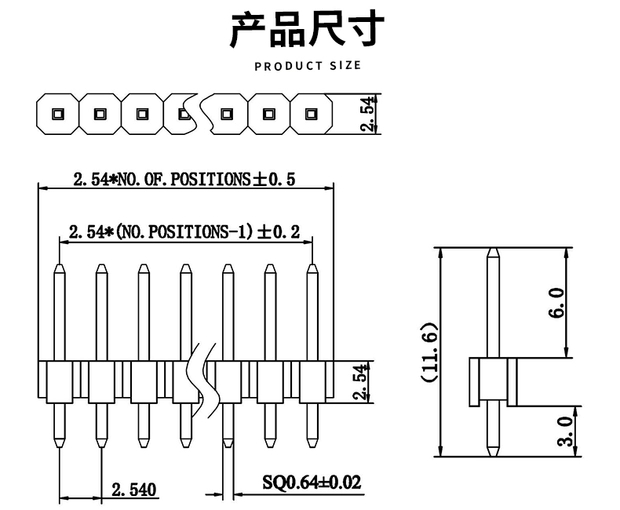
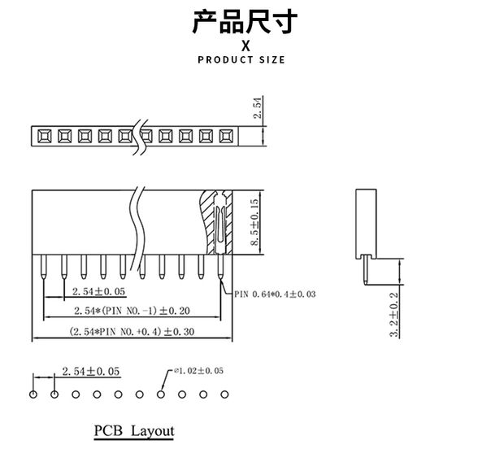
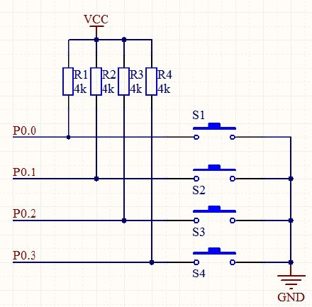
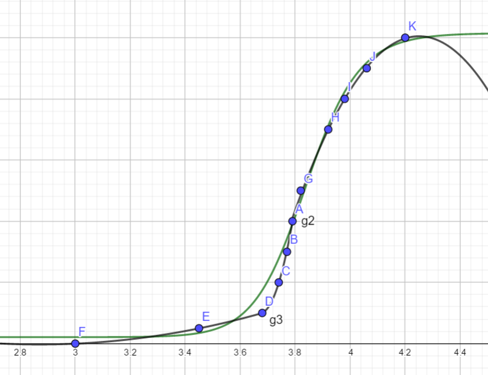

# 4-key TTGO T-Display 蓝牙机械键盘


ttgo屏幕面朝外，（长）排针连接底板，中间空隙放电池，另一面机械键盘轴朝外。


排母的焊脚刺手怎么办？。。热熔胶？


## 材料

电池：大概选20mm宽，40/50mm长的3.7v锂电池。

TTGO T-Display 40元？ 排母一起买了

键轴，键帽

PCB打样 5元？

电池：





排母，长排针？排母8.5mm的塑料位，电源接头算3mm，紧靠电源接头有41mm到底部。买厚度5mm，长40mm的应该可以。

不保守的话可以买：8mm厚35mm长，或者5mm厚55mm长。

可以考虑最后完成了再买电池。

没想到键盘轴的焊脚突出了这么多。。。


排针高度


## 接线

[引脚选择](https://randomnerdtutorials.com/esp32-pinout-reference-gpios/)：避开的引脚：

1. 避开引脚2 似乎连了内部led
2. 避开34-39的input only脚，没有内部上下拉
3. 使用RTC GPIO可以在睡眠时唤醒
4. 34 to 39 can’t generate PWM 没啥关系
5. must be HIGH during boot
6. 要不要把spi口让开？没必要
7. Capacitive touch：4 0 2 15 13 12 14 27 33 32

就选13 15 32 33 或者 32 33 25 26


接线，看看是否可以内部上拉，应该可以。但是留出电阻的位置



有内部上拉就可以直接接地，没有则要每路接个电阻了。考虑留大电阻位置，没有内部上拉再加电阻。


#### 选轴

红轴或者茶轴了。都声音不大，红轴段落感更强。

封装选Mx_Alps_Hybrid -1u -noled

电阻应该是1/4W的，选AXIAL-0.4， 10.2mm


#### 焊接电池

还是先焊电池吧。。。也找纸胶带来，把焊点封住。怎么让两个线呆在一起方便焊？把外皮撕掉点吧。。。撕不开。。。找打火机吧。。。麻了


### PCB设计

排母和按键的方向不同，不能单面，还是双面吧，两面都有焊盘才好焊接。 


#### 边缘

1. 都圆角，不割手
2. 机械键盘轴大概是15\*15？还是14\*14。还是突出来和键帽齐平吧。
3. 多写点字


### pinmap

GPIO13 - K2 - 底部是TMK字样

GPIO33 - K4

GPIO32 - K3


## 软件

### 索引

ESP32库代码在 `AppData\Local\Arduino15\packages\esp32` 。VScode打开以搜索库。

左侧按键GPIO 0 （IO0），右侧按键 GPIO 35（KEY1）自带电阻拉高到3V3。


先安装ESP32开发板到arduino，然后 [裸机蓝牙键盘库](https://github.com/asterics/esp32_mouse_keyboard) ，然后是[TTGO的屏幕支持库](https://github.com/Xinyuan-LilyGO/TTGO-T-Display)。


### 基于Arduino

[Arduino 蓝牙键盘库](https://github.com/T-vK/ESP32-BLE-Keyboard) 虽然不是很爽，还是赶紧做出一个能用的出来。

1. 设置CPU频率 -ok 直接选
2. debounce按键
3. 使用GPIO的中断而不是轮询。 ok 
4. 增加计时器，时间过长后休眠
5. 休眠后蓝牙重连测试：
6. 使用屏幕

没想到我也遇到了需要freeRTOS的一天。ESP32有两个核心，arduino IDE只运行在core 1，core 0闲着。只要我分工合理，就不需要互斥。freeRTOS应该也不会抢占。

首先弄清楚中断注册了之后在哪个核上处理：[看文档](https://docs.espressif.com/projects/esp-idf/en/latest/esp32/api-reference/system/intr_alloc.html) 应该是谁分配谁处理吧。

那就让core0专门处理蓝牙，core1专门处理中断，调用task_create给core0吧

[简单的freertos教程](https://savjee.be/2020/01/multitasking-esp32-arduino-freertos/) 


### 按键防抖

麻了，一生之敌

普通的按键防抖基于一个无限采样的循环，当值开始变化的时候记录变化时间，如果当前时间距离上次变化时间超过了防抖动时间，则此时采样的结果稳定。剩下的就是判断键盘状态变化。

问题的本质在于，需要在抖动结束的时候及时发现已经过了debounce时间，而普通的中断只能发现电平变化。

所以一个中断加一个timer就完美了？？！！！timer资源够多吗？

是否搞个互斥，保证每次只有一个isr实例运行？或者用一个中断例程处理三个键的采样？

最终：使用timer防抖，在每次状态改变的时候重置timer，在一定时间后采样。使用3个freertos的 timer，使用同一个处理服务函数，通过*pvTimerID* 区分是哪个键。初始化的时候静态分配timer，并立刻停止timer。在收到Change中断的时候reset。

WE可能是wakeup enable的意思


### 蓝牙与按键

只要按下去，松开之前等几秒就没有问题。看来是蓝牙那边发送得有点慢啊。

似乎我面临的就是重入问题？，只要让timer互斥一下？也就是当前timer没有结束，就reset了timer，timer再次运行？还是什么？还是启动了多个timer的callback?

算了，还是给蓝牙那边搞个队列，搞个专门处理发送的task吧。

居然就能用了。。。


### sleep

1. 普通的GPIO wakeup还是算了，只能light sleep。
2. ULP协处理器需要编写汇编，还是算了。
3. 使用内部上拉需要启动RTC外设的电源域，增加一点点耗电？

touchpad唤醒不太懂，我按键能当touch吗？所以主要的两个唤醒源就是ext0：单GPIO唤醒，ext1：多GPIO any_high/all_low唤醒。也就是要么三个键全部按下唤醒，要么单个键唤醒。

有点感觉这功能甚至不如电源开关，还不耗任何电。

话说三个键全部按下唤醒似乎可以防误触啊。不错，就用这个了。

首先设置变量保存上一次使用的时间。如果超过4分钟没有使用就休眠。就用loop循环去检测。

休眠醒来似乎和重启没什么区别啊。。。因此在setup函数之前设置打印唤醒原因用于debug，然后对相关的引脚调用rtc_gpio_deinit重新配置。loop函数休眠前设置唤醒源，并设置好引脚拉高即可。


### 电池管理

[FactoryTest.ino](https://github.com/Xinyuan-LilyGO/TTGO-T-Display/blob/master/TFT_eSPI/examples/FactoryTest/FactoryTest.ino) 这里有代码

然后就是看怎么发送给手机那边了。如何蓝牙发送电池电量，和改名字？？TODO


电量计算问题：最低电压是3V，这时候得赶紧充电。，满电就是4.2v了。ttgo板子上的电源管理芯片有过充保护，但是过放保护不知道有没有。。。看来长时间不用还是要取下电池啊，不然伤电池。


```
uint16_t v = analogRead(ADC_PIN);
float battery_voltage = ((float)v / 4095.0) * 2.0 * 3.3 * (vref / 1000.0);
```

计算公式怎么来的？电路中似乎有个电压减半，那ESP32的测量范围就是。1.5-2.1v了。ADC_ATTEN_DB_11可以测量到2.6v电压。12bit的adc也就只有4096种取值。TODO

不是应该用esp_adc_cal_raw_to_voltage吗。。。难道他们把原理提取出来了？？


另外还有两个小按钮，就不给他们搞什么timer了，麻了，就设置个bool的变量吧，如果loop函数检测到了就打开屏幕显示一下电量。另外一个按钮就用来直接进入睡眠。


TODO:

1. 显示电量前再检测一下电池电压。每次休眠启动的时候检测的电压都是1.几v。
2. 看看是不是ADC使用得不对，我现在电压度数比万用表高了0.14v，怪不得我的电压爆炸。
3. 电池电压转为电量百分比，显示在蓝牙和屏幕那边，看看蓝牙设备名称怎么改

4. 电池还不很耐用啊，看看是不是有什么提升空间，在工作时而不是休眠时。

电池电压和电量绝对不是线性关系啊。。。需要的是电压转电量的表。..

搞个[在线曲线拟合](http://www.qinms.com/webapp/curvefit/cf.aspx)哈哈哈。

曲线不理想啊，分段拟合吧，两个二次曲线

```
100%----4.20V
0.14
90%-----4.06V
0.08v
80%-----3.98V
0.06v
70%-----3.92V
0.05
60%-----3.87V
0.05
50%-----3.82V
0.03
40%-----3.79V
0.02
30%-----3.77V
0.03
20%-----3.74V
0.06
10%-----3.68V
0.23
5%------3.45V
0.45
0%------3.00V
```


```
a(x+d)2+e
-496.636+238.432 x-28.05 x^(2)    3.79<x<4.2
=-28.05(x-4.25)^(2)+10
2938.5-1599.55x +217.75*x^(2)     3.68<x<3.79
217.75(x-3.673)^(2)+1
12.84 + -8.97*x +1.563*x^(2)      x<3.68
1.563 (x-2.87)^(2)-0.03
```


Curve(x,-28.05(x-4.25)^(2)+10,x,3.79,5)
Curve(x, 217.75(x-3.673)^(2)+1,x,3.68,3.79)
Curve(x, 1.563 (x-2.87)^(2)-0.03,x,2.5,3.68)




### 屏幕

把屏幕用起来，正好ttgo这板子上还有两个键，就用来显示几秒电量然后关掉吧。


### deep sleep

耗电似乎还是主要是使用状态下。

内部上下拉和外部不一样时的漏电问题？？

ext1才能关闭rtc的外设供电。两个板子上的按钮，IO0是悬浮的，KEY1是自带上拉的。IO0也是Flash按钮。

似乎没有什么改进的余地了。tft的sleep也已经用上了。或许打从一开始就不用tft比较好。只要不初始化，电量就一定是最低的。不，现在已经优化得可以了，已经没什么余地了。

休眠时电量保持：

1. tft显示屏方面达到完全休眠。tft的DISPOFF和SLEEP都用上了。除非完全不用显示屏。
2. RTC GPIO isolate方面目前似乎没有漏点的引脚。
3. ESP32也是最强的deep sleep模式了。
4. 自身体验上，休眠确实不怎么耗电，已经挺好的了。

工作模式下电量优化：

1. esp32方面已经是80mhz的最低频率了。

2. wifi蓝牙是一体的，不好禁用吧

3. [在modem sleep模式下保持蓝牙连接](https://github.com/espressif/esp-idf/issues/947#issuecomment-500312453) 需要外部晶振，软件配置。不知道支不支持。BLE wakeup？

   change TX power？算了。听说降频到40mhz会有点问题，还是算了，说明不能休息，休息了蓝牙就不能正常工作了。就这样吧。。

优化电量曲线：

1. 似乎3.9v附近电量掉得确实太快了。。？


展望：

1. ESP32-S3和ESP32-C3（risc-v）都还买不到。。。


## 休眠唤醒debug

1. 问题只出现在，睡眠后，试图在接电池的情况下唤醒。
2. reset可以唤醒。
3. 不是上拉的问题，也不是唤醒了瞬间睡眠的问题。
4. 唤醒失败后，再接上电也不能唤醒。

RTC协处理器可能彻底关了？？


试图在接电池的情况下唤醒的时候，发生了些什么。

电池本身状态正常，板子单独接电也正常，问题应该是板子的供电部分，或者是电池和板子的协作上。

那暂时躺平吧，直接取消任何唤醒，用reset唤醒。


2021年4月16日 再次Debug，这次Reset键被压坏了，所以买了个新板子。发现单接电池直接出现休眠唤醒问题。插电就没问题。可能真的是：

1. 电池问题吧。。。
2. 代码问题

代码也被我改乱了，先备份一份现在的代码，然后回退到之前的稳定代码试试。大概是不行的，然后再把新板子的电源端子线接到另外一块电池上，先不急着焊排针了。

麻了，换了电池，问题依旧。。。


我


